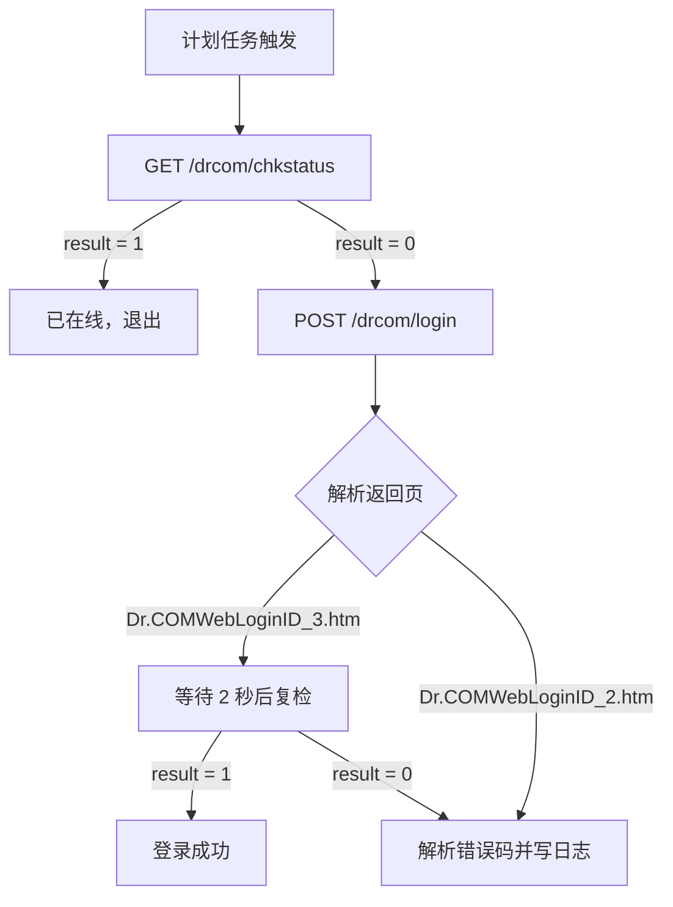

# 校园网自动登录（Dr.COM / 哆点）

Windows 下的校园网 Portal 自动登录工具。检测到掉线后自动重新认证，支持开机自启、定时检查、网络切换触发，账号密码使用 Windows DPAPI 加密保存。

[](https://learn.microsoft.com/powershell/)
[](https://www.microsoft.com/windows/)
[](LICENSE)

---

## 功能

- **掉线自动重连**：默认每 2 分钟查询一次 Portal 在线状态，掉线后自动提交账号密码。
- **开机自启**：登录 Windows 后由计划任务自动启动，无需手动运行。
- **网络变化触发**：切换 Wi-Fi、插拔网线、网络配置文件变化时立即检查。
- **密码加密**：使用 Windows DPAPI 加密保存，只有当前 Windows 用户能解密。
- **错误翻译**：调用 Portal 的错误码接口，把 `userid error2` 之类的代码翻译成可读提示。
- **限流保护**：识别“注销后 3 秒内禁止重登”等限流响应，自动等待后重试。
- **日志记录**：所有操作写入 `%LOCALAPPDATA%\CampusAutoLogin\login.log`，方便排查。

## 工作原理



> 本项目目前针对 **Dr.COM（哆点）ePortal** 做了适配。其他学校的 Portal 可参考 [`generic/`](generic/) 下的通用版本。

## 快速开始

### 1. 下载

```powershell
git clone https://github.com/pvxacct/campus-network-auto-login.git
cd campus-network-auto-login
```

或者直接点击 GitHub 页面右上角的 **Code → Download ZIP**，解压后进入目录。

> 如果本机 Git 报 `schannel: SEC_E_NO_CREDENTIALS`，可以改用 OpenSSL 后端：
>
> ```powershell
> git -c http.sslBackend=openssl -c http.sslVerify=false clone https://github.com/pvxacct/campus-network-auto-login.git
> ```
>
> 或者使用 SSH：
>
> ```powershell
> git clone git@github.com:pvxacct/campus-network-auto-login.git
> ```

### 2. 修改 Portal 地址

打开 `drcom-config.json`，把 `PortalHost` 改成你学校的 Portal 地址：

```json
{
  "PortalHost": "10.66.209.2",
  "EportalPort": 801,
  "StatusPath": "/drcom/chkstatus",
  "LoginPath": "/drcom/login"
}
```

如果你不确定地址和字段，请参考 [`docs/DRCOM-PROTOCOL.md`](docs/DRCOM-PROTOCOL.md)，用浏览器开发者工具抓一次登录请求。

### 3. 一键安装

按 `Win` 搜索 `PowerShell`，右键 **以管理员身份运行**，然后执行：

```powershell
powershell -ExecutionPolicy Bypass -File .\Setup-DrcomAutoLogin.ps1
```

脚本会依次完成：

1. 提示输入校园网账号和密码，用 DPAPI 加密保存到 `credential.xml`；
2. 注册计划任务 `CampusAutoLogin`；
3. 立即执行一次登录测试。

安装完成后：

- 每次登录 Windows 自动启动；
- 每 2 分钟检查一次，掉线自动重连；
- 切换 Wi-Fi、插拔网线时也会触发；
- 日志位于 `%LOCALAPPDATA%\CampusAutoLogin\login.log`。

## 手动测试

```powershell
# 查询状态，掉线才登录
powershell -ExecutionPolicy Bypass -File .\DrcomAutoLogin.ps1

# 强制登录一次（不判断是否已在线）
powershell -ExecutionPolicy Bypass -File .\DrcomAutoLogin.ps1 -Force

# 先注销当前会话，等 5 秒后重新登录
powershell -ExecutionPolicy Bypass -File .\DrcomAutoLogin.ps1 -Relogin
```

查看日志：

```powershell
Get-Content "$env:LOCALAPPDATA\CampusAutoLogin\login.log" -Tail 50
```

## 配置说明

`drcom-config.json`：

| 字段 | 说明 |
| --- | --- |
| `PortalHost` | Portal 地址，例如 `10.66.209.2` |
| `EportalPort` | ePortal 端口，Dr.COM 常见为 `801` |
| `StatusPath` | 状态查询路径，默认 `/drcom/chkstatus` |
| `LoginPath` | 登录路径，默认 `/drcom/login` |
| `LogoutPath` | 注销路径，默认 `/drcom/logout` |
| `ErrorPromptPath` | 错误码翻译接口路径 |
| `StaticFields` | 登录时必须一起提交的固定字段 |
| `CheckIntervalMinutes` | 计划任务检查间隔，默认 2 分钟 |

## 计划任务

安装后可在“任务计划程序”中看到 `CampusAutoLogin`，触发条件：

- 用户登录时；
- 注册后每 N 分钟（默认 2 分钟）；
- 网络配置文件变化时（Event ID 10000）。

常用命令：

```powershell
Start-ScheduledTask -TaskName CampusAutoLogin
Get-ScheduledTask -TaskName CampusAutoLogin | Get-ScheduledTaskInfo
Unregister-ScheduledTask -TaskName CampusAutoLogin -Confirm:$false
```

也可以直接运行卸载脚本：

```powershell
powershell -ExecutionPolicy Bypass -File .\Uninstall-CampusAutoLoginTask.ps1
```

## 常见问题

### 1. `userid error2 -> 密码错误`

在部分 Dr.COM 部署中，`userid error2` 实际表示 **“账号已在线 / 重复认证”**，并不是密码错误。可以用一个明显错误的密码做对照测试：

- 如果错误密码和正确密码返回完全相同的 `userid error2`，说明该错误码是“已在线”；
- 如果只有正确密码返回其他错误，说明需要检查密码。

脚本正常模式下会先查询状态，只有 `result=0` 才登录，因此不会和已在线设备冲突。

### 2. `error5 waitsec <3`

注销后 Portal 要求至少等待 3 秒才能重新登录。脚本的 `-Relogin` 模式默认等待 5 秒。

### 3. 账号被 MAC 绑定

部分学校会把账号绑定到首次认证的 MAC 地址。如果换设备登录失败，请联系网络中心解绑，或使用原来那台设备执行脚本。

### 4. 需要验证码

纯脚本无法自动识别验证码。可以联系网络中心关闭验证码，或改造成半自动模式。

### 5. 提示“禁止运行脚本”

使用 `-ExecutionPolicy Bypass` 启动即可：

```powershell
powershell -ExecutionPolicy Bypass -File .\DrcomAutoLogin.ps1
```

更多问题见 [`docs/TROUBLESHOOTING.md`](docs/TROUBLESHOOTING.md)。

## 安全说明

- `credential.xml` 使用 Windows DPAPI 加密，与当前 Windows 用户绑定；
- 不要把 `credential.xml` 提交到 Git 或复制到其他电脑；
- `.gitignore` 已默认忽略 `credential.xml`、`*.log` 和 `work/`；
- 公开仓库中不要写入自己的学号、密码、Portal 内网地址等个人信息。

## 目录结构

```text
.
├── DrcomAutoLogin.ps1                 # 主脚本
├── Save-DrcomCredential.ps1           # 保存账号密码
├── Install-CampusAutoLoginTask.ps1    # 注册计划任务
├── Setup-DrcomAutoLogin.ps1           # 一键安装
├── Uninstall-CampusAutoLoginTask.ps1  # 卸载
├── drcom-config.json                  # Portal 配置
├── docs/
│   ├── DRCOM-PROTOCOL.md              # 抓包与协议说明
│   └── TROUBLESHOOTING.md             # 常见问题
└── generic/
    ├── CampusAutoLogin.ps1            # 通用 Portal 版本
    └── config.example.json            # 通用版配置示例
```

## 兼容性

- Windows 10 / Windows 11
- Windows PowerShell 5.1 及以上
- 脚本文件使用 UTF-8 with BOM 保存，确保 Windows PowerShell 5.1 正确解析中文

## 其他学校

如果不是 Dr.COM，或者登录接口不是 `/drcom/login`，可以使用 [`generic/CampusAutoLogin.ps1`](generic/CampusAutoLogin.ps1)：

1. 用浏览器开发者工具抓取登录请求；
2. 把 URL、方法、字段名、密码加密方式填入 `generic/config.example.json`；
3. 用同样的方式注册计划任务。

## License

[MIT](LICENSE)
