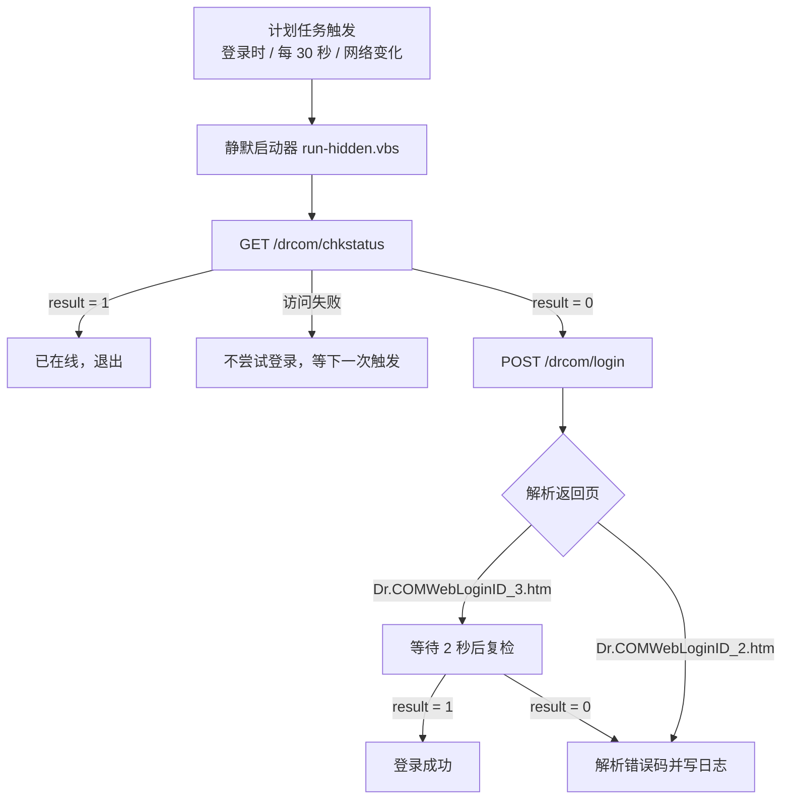

# 校园网自动登录（Dr.COM / 哆点）

Windows 下的校园网 Portal 自动登录工具。**每 30 秒**检查一次在线状态，掉线后自动重新认证；支持开机自启、网络切换立即触发、后台静默运行（不会弹黑窗口），账号密码使用 Windows DPAPI 加密保存。

[](https://learn.microsoft.com/powershell/)
[](https://www.microsoft.com/windows/)
[](LICENSE)

---

## 功能

- **掉线自动重连**：默认每 30 秒查询一次 Portal 在线状态，掉线后自动提交账号密码；
- **开机自启**：登录 Windows 后 15 秒自动开始检查，无需手动运行；
- **网络变化触发**：切换 Wi-Fi、插拔网线、网络配置文件变化时立即检查；
- **后台静默**：任务通过自动生成的隐藏启动器运行，不会每 30 秒闪一次黑窗口；
- **密码加密**：使用 Windows DPAPI 加密保存，只有当前 Windows 用户能解密，不入库、不明文落盘；
- **失败退避**：连续登录失败会自动进入冷却（2 分钟起，最多 30 分钟），不会反复撞 Portal；
- **防重入**：上一次检查没结束时，新的触发会被跳过，不会叠加执行；
- **可观测**：每次运行都会写入 `state.json`（运行次数、当前状态、最近结果），一眼就能看出脚本有没有在跑；
- **错误翻译**：调用 Portal 的错误码接口，把 `userid error2` 之类的代码翻译成可读提示；
- **一键安装 / 一键诊断**：双击 `一键安装.cmd` 即可完成；出问题跑一次诊断脚本生成报告。
- **一键暂停 / 恢复**：双击 `暂停-校园网自动登录.cmd` 随时停掉自动检查，双击 `恢复-校园网自动登录.cmd` 一键恢复并立即检查一次。
- **请求量可控**：在线时自动降频（默认每 120 秒才真的查询一次），掉线后仍然每 30 秒快速重试；登录请求还有每小时上限，避免账号被 Portal 风控。

## 工作原理



> 本项目针对 **Dr.COM（哆点）ePortal** 适配。其他学校的 Portal 可参考 [`generic/`](generic/) 下的通用版本。

## 快速开始

### 1. 下载

```powershell
git clone https://github.com/pvxacct/campus-network-auto-login.git
cd campus-network-auto-login
```

或者直接点击 GitHub 页面右上角的 **Code → Download ZIP**，解压后进入目录。

> 如果本机 Git 报 `schannel: SEC_E_NO_CREDENTIALS`，可以改用 OpenSSL 后端：
>
> ```powershell
> git -c http.sslBackend=openssl -c http.sslVerify=false clone https://github.com/pvxacct/campus-network-auto-login.git
> ```
>
> 或者使用 SSH：
>
> ```powershell
> git clone git@github.com:pvxacct/campus-network-auto-login.git
> ```

### 2. 改 Portal 地址（非本项目学校才需要）

打开 `drcom-config.json`，把 `PortalHost` 改成你学校的 Portal 地址：

```json
{
  "PortalHost": "10.66.209.2",
  "EportalPort": 801,
  "StatusPath": "/drcom/chkstatus",
  "LoginPath": "/drcom/login",
  "CheckIntervalSeconds": 30
}
```

如果不知道地址和字段，请参考 [`docs/DRCOM-PROTOCOL.md`](docs/DRCOM-PROTOCOL.md)，用浏览器开发者工具抓一次登录请求。

### 3. 一键安装

**双击 `一键安装.cmd`**，在弹出的 UAC 窗口点“是”，然后按提示输入一次校园网账号密码。

脚本会自动完成：

1. 申请管理员权限（UAC 弹窗一次）；
2. 提示输入账号密码，用 DPAPI 加密保存到 `%LOCALAPPDATA%\CampusAutoLogin\credential.xml`；
3. 注册计划任务 `CampusAutoLogin`（登录时启动、每 30 秒检查、网络变化触发）；
4. **实际观察 80 秒**，确认任务真的被自动执行了（自检）；
5. 立即检查一次当前在线状态。

自检通过会显示：

```text
自检通过：80 秒内脚本被自动执行了 3 次（运行方式：vbs），任务已正常工作。
```

### 4. 确认一切正常（可选）

```powershell
# 只看状态，不做任何登录
powershell -ExecutionPolicy Bypass -File .\DrcomAutoLogin.ps1 -CheckOnly

# 看运行状态：RunCount 会随时间不断变大
Get-Content "$env:LOCALAPPDATA\CampusAutoLogin\state.json"

# 看日志
Get-Content "$env:LOCALAPPDATA\CampusAutoLogin\login.log" -Tail 30
```

## 手动安装（不用一键脚本）

```powershell
# 1) 保存账号密码（可以在普通权限下运行）
powershell -ExecutionPolicy Bypass -File .\Save-DrcomCredential.ps1

# 2) 注册计划任务（会自动申请管理员权限）
powershell -ExecutionPolicy Bypass -File .\Install-CampusAutoLoginTask.ps1

# 3) 立即检查一次
powershell -ExecutionPolicy Bypass -File .\DrcomAutoLogin.ps1
```

## 手动测试

```powershell
# 查询状态，掉线才登录
powershell -ExecutionPolicy Bypass -File .\DrcomAutoLogin.ps1

# 只查询状态，不登录
powershell -ExecutionPolicy Bypass -File .\DrcomAutoLogin.ps1 -CheckOnly

# 强制登录一次（不判断是否已在线）
powershell -ExecutionPolicy Bypass -File .\DrcomAutoLogin.ps1 -Force

# 先注销当前会话，等 5 秒后重新登录
powershell -ExecutionPolicy Bypass -File .\DrcomAutoLogin.ps1 -Relogin
```

## 出问题了先跑诊断

```powershell
powershell -ExecutionPolicy Bypass -File .\Diagnose-CampusAutoLogin.ps1
```

它会检查运行环境、Portal 连通性、凭据、日志、计划任务、隐藏启动器，并把结果保存成
`%LOCALAPPDATA%\CampusAutoLogin\diagnose-<时间>.txt`。

## 配置说明

`drcom-config.json`：

| 字段 | 说明 |
| --- | --- |
| `PortalHost` | Portal 地址，例如 `10.66.209.2` |
| `EportalPort` | ePortal 端口，Dr.COM 常见为 `801` |
| `StatusPath` | 状态查询路径，默认 `/drcom/chkstatus` |
| `LoginPath` | 登录路径，默认 `/drcom/login` |
| `LogoutPath` | 注销路径，默认 `/drcom/logout` |
| `ErrorPromptPath` | 错误码翻译接口路径 |
| `CheckIntervalSeconds` | 计划任务检查间隔，默认 30 秒（改成 60 等数值后重新运行安装脚本） |
| `OnlineCheckIntervalSeconds` | **在线时**的实际查询间隔，默认 120 秒；计划任务照旧每 30 秒触发，由脚本自己决定要不要真的联网查询。改成 `0` 表示每次触发都查询，改成 `300` 更省 |
| `LoginHourlyLimit` | 最近 1 小时内最多发起多少次登录请求，默认 12 次；超过就跳过登录并等下一个小时窗口，防止账号被风控。改成 `0` 表示不限制 |
| `StaticFields` | 登录时必须一起提交的固定字段 |

## 计划任务

安装后可在“任务计划程序”中看到 `CampusAutoLogin`：

| 项目 | 说明 |
| --- | --- |
| 触发器 | 登录 Windows 后 15 秒、两条错开的 1 分钟触发器（等效每 30 秒一次）、网络配置文件变化（Event ID 10000） |
| 运行方式 | 当前用户、普通权限（不需要管理员，不会弹 UAC） |
| 启动命令 | `wscript.exe //B //Nologo "%LOCALAPPDATA%\CampusAutoLogin\run-hidden.vbs"` |
| 并发策略 | `IgnoreNew`（上一次没跑完就跳过本次） |
| 电源策略 | 电池供电时也运行、不因为切换电源而停止、错过的触发会尽快补上 |

> Windows 的任务计划管理器对触发器写法有两条硬性限制：重复间隔**最小 1 分钟**（写 `PT30S` 会直接注册失败），表示“无限期重复”时必须**省略 `<Duration>` 元素**（写 `PT0S` 或超大数值都会被判为 out of range）。所以安装脚本默认用 **两条各 1 分钟、彼此错开 30 秒的触发器**来实现 30 秒检查，并在安装时打印实际生效的间隔。如果某台机器连这种写法都不接受，脚本会自动降级（先补 30 天时长，再退化成每分钟一次），并把结果打印出来。

> **注意：触发器频率 ≠ 实际请求频率。** 任务每 30 秒被唤起一次，但脚本会先看一眼状态文件：如果上次刚确认在线、又还没到 `OnlineCheckIntervalSeconds`（默认 120 秒），就直接退出，**一个请求都不发**。只有掉线、Portal 不可达、刚登录成功这几种情况才维持 30 秒快速检查。

常用命令：

```powershell
Start-ScheduledTask -TaskName CampusAutoLogin          # 立即运行一次
Get-ScheduledTaskInfo -TaskName CampusAutoLogin        # 看上次运行结果
Get-ScheduledTask -TaskName CampusAutoLogin | Select-Object -ExpandProperty Triggers
Unregister-ScheduledTask -TaskName CampusAutoLogin -Confirm:$false
```

### 暂停 / 恢复

不想让脚本继续跑（例如回家、换网络、想手动登录）时，直接双击：

| 双击这个文件 | 作用 |
| --- | --- |
| `暂停-校园网自动登录.cmd` | 暂停：计划任务变成“已禁用”，不再自动检查、不再自动登录 |
| `恢复-校园网自动登录.cmd` | 恢复：重新启用，并立刻触发一次检查（掉线会马上登录） |

两个文件都会自动弹出 UAC 授权窗口，点“是”即可，不需要手动开管理员 PowerShell。

暂停只是把计划任务禁用，**账号密码（DPAPI 加密）、日志、状态文件全部原样保留**，随时可以恢复；想彻底删除请用 `Uninstall-CampusAutoLoginTask.ps1`。

也可以直接看当前状态（不需要管理员权限）：

```powershell
powershell -ExecutionPolicy Bypass -File .\CampusAutoLoginTaskState.ps1 -Action Status
```

图形界面等效操作：打开“任务计划程序”，右键 `CampusAutoLogin` → “禁用” / “启用”。

## 目录结构

```text
.
├── 一键安装.cmd                        # 双击安装（自动申请管理员权限）
├── Setup-DrcomAutoLogin.ps1            # 一键安装主逻辑
├── DrcomAutoLogin.ps1                  # 主脚本（状态检查 + 自动登录）
├── Save-DrcomCredential.ps1            # 保存账号密码（DPAPI 加密）
├── Install-CampusAutoLoginTask.ps1     # 注册计划任务（每 30 秒、自检）
├── Uninstall-CampusAutoLoginTask.ps1   # 卸载计划任务
├── Diagnose-CampusAutoLogin.ps1        # 生成诊断报告
├── 暂停-校园网自动登录.cmd              # 双击暂停（自动申请管理员权限）
├── 恢复-校园网自动登录.cmd              # 双击恢复（自动申请管理员权限）
├── CampusAutoLoginTaskState.ps1        # 暂停 / 恢复 / 查看状态的实现
├── drcom-config.json                   # Portal 配置
├── CHANGELOG.md                        # 更新日志
├── docs/
│   ├── DRCOM-PROTOCOL.md               # 抓包与协议说明
│   └── TROUBLESHOOTING.md              # 常见问题
└── generic/
    ├── CampusAutoLogin.ps1             # 通用 Portal 版本
    ├── Save-CampusCredential.ps1       # 通用版凭据保存
    └── config.example.json             # 通用版配置示例
```

运行时产生的文件都在 `%LOCALAPPDATA%\CampusAutoLogin\`：

| 文件 | 内容 |
| --- | --- |
| `credential.xml` | DPAPI 加密的账号密码（只有当前 Windows 用户能解密） |
| `state.json` | 运行次数、当前在线状态、最近一次结果、连续失败次数 |
| `login.log` | 仅记录有意义的事件与每小时心跳（不会每 30 秒刷一条） |
| `run-hidden.vbs` | 自动生成的隐藏启动器 |
| `diagnose-*.txt` | 诊断报告 |

## 常见问题

### 1. 脚本好像没有正常运行

先运行 `Diagnose-CampusAutoLogin.ps1`。报告里若“没有 `state.json`”，说明任务没有真正跑起来；此时重新运行安装脚本，它会重新注册并自动自检。

### 2. `userid error2 -> 密码错误`

在部分 Dr.COM 部署中，`userid error2` 实际表示 **“账号已在线 / 重复认证”**，并不是密码错误。可以用一个明显错误的密码做对照测试：

- 如果错误密码和正确密码返回完全相同的 `userid error2`，说明该错误码是“已在线”；
- 如果只有正确密码返回其他错误，说明需要检查密码。

脚本只有确认掉线后才登录，并且遇到这个错误码会复检状态，确认在线就按成功处理。

### 3. 每 30 秒会不会太频繁

每 30 秒只有一次轻量的状态查询（浏览器打开 Portal 页面时也是这个查询），不会触发限流；限流只针对登录请求，脚本已经识别并自动等待重试。想更省一点就把 `CheckIntervalSeconds` 改成 `60`。

### 4. `error5 waitsec <3`

注销后 Portal 要求至少等待 3 秒才能重新登录。`-Relogin` 模式默认等待 5 秒。

### 5. 账号被 MAC 绑定

部分学校会把账号绑定到首次认证的 MAC 地址。如果换设备登录失败，请联系网络中心解绑，或使用原来那台设备执行脚本。

### 6. 需要验证码

纯脚本无法自动识别验证码。可以联系网络中心关闭验证码，或改造成半自动模式。

### 7. 提示“禁止运行脚本”

使用 `-ExecutionPolicy Bypass` 启动即可：

```powershell
powershell -ExecutionPolicy Bypass -File .\DrcomAutoLogin.ps1
```

### 8. 请求太多会不会被 Portal 风控

现在有两道保险：

- **在线时降频**：`OnlineCheckIntervalSeconds` 默认 120 秒。任务虽然每 30 秒被唤起一次，但脚本发现「上次刚确认在线、又没到间隔」就直接退出，**不发任何请求**。在线稳定时每天约 720 次查询（原先是 2880 次）；改成 `300` 就只剩约 288 次。
- **登录请求限速**：`LoginHourlyLimit` 默认 12 次/小时，超过就跳过登录、等下一个小时窗口，日志里会写明原因。单次运行内也只登录 1 次（`-RetryCount` 默认 1），登录失败后按 2 → 30 分钟逐级退避。

如果已经被风控，先双击 `暂停-校园网自动登录.cmd` 让脚本停下来，等账号恢复正常后，把 `drcom-config.json` 里的 `OnlineCheckIntervalSeconds` 调成 `300` 或更大再恢复。

更多问题见 [`docs/TROUBLESHOOTING.md`](docs/TROUBLESHOOTING.md)。

## 卸载

```powershell
# 只删任务，保留凭据和日志
powershell -ExecutionPolicy Bypass -File .\Uninstall-CampusAutoLoginTask.ps1

# 任务 + 凭据 + 日志 + 状态一起删
powershell -ExecutionPolicy Bypass -File .\Uninstall-CampusAutoLoginTask.ps1 -RemoveData
```

## 安全说明

- `credential.xml` 使用 Windows DPAPI 加密，与当前 Windows 用户绑定；
- 不要把它提交到 Git 或复制到其他电脑；
- `.gitignore` 已默认忽略 `credential.xml`、`*.log`、`work/`、`id_ed25519`、`*.pem`、`*.ppk`；
- 公开仓库中不要写入自己的学号、密码、Portal 内网地址等个人信息。

## 其他学校

如果不是 Dr.COM，或者登录接口不是 `/drcom/login`，可以使用 [`generic/CampusAutoLogin.ps1`](generic/CampusAutoLogin.ps1)：

1. 复制配置模板：

```powershell
Copy-Item .\generic\config.example.json .\generic\config.json
```

2. 用浏览器开发者工具抓取登录请求；
3. 把 URL、方法、字段名、密码加密方式填入 `generic/config.json`；
4. 保存账号密码：

```powershell
powershell -ExecutionPolicy Bypass -File .\generic\Save-CampusCredential.ps1
```

5. 手动测试：

```powershell
powershell -ExecutionPolicy Bypass -File .\generic\CampusAutoLogin.ps1
```

6. 注册计划任务：

```powershell
powershell -ExecutionPolicy Bypass -File .\Install-CampusAutoLoginTask.ps1 -ScriptPath .\generic\CampusAutoLogin.ps1 -ConfigPath .\generic\config.json
```

## 兼容性

- Windows 10 / Windows 11
- Windows PowerShell 5.1 及以上（不需要 PowerShell 7）
- 脚本文件使用 UTF-8 with BOM 保存，确保 Windows PowerShell 5.1 正确解析中文

## 更新日志

各版本的改动记录见 [CHANGELOG.md](CHANGELOG.md)，当前版本：**1.1.0**（2026-09-12）。

## License

[MIT](LICENSE)

